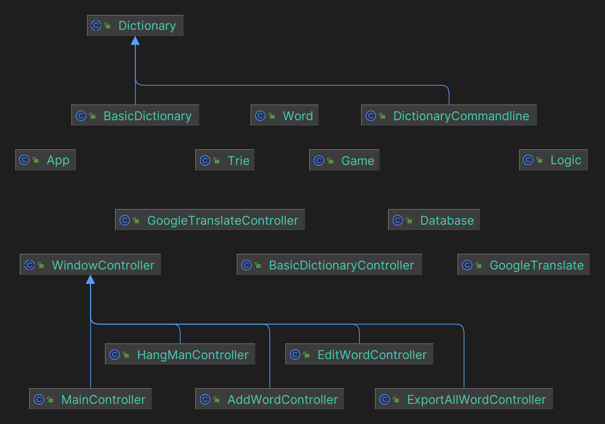
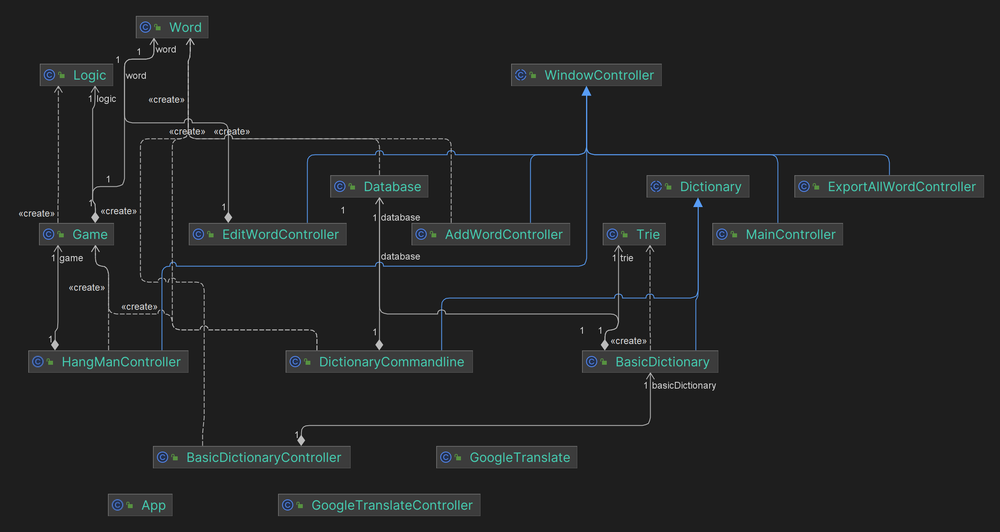

# Từ Điển Hỗ Trợ Học Tiếng Anh

## Mục Lục

1. [Giới Thiệu về Ứng Dụng](#giới-thiệu-về-ứng-dụng)
2. [Chức Năng](#chức-năng)
3. [Kỹ Thuật Đã Sử Dụng](#kỹ-thuật-đã-sử-dụng)
4. [Cách Cài Đặt](#cách-cài-đặt)
5. [Hướng Phát Triển](#hướng-phát-triển)
6. [Class Diagram](#class-diagram)

## Chức Năng

Ứng dụng từ điển này có các chức năng cơ bản sau:

- **Từ điển**:
  - Tìm kiếm từ vựng trong cơ sở dữ liệu cục bộ.
  - Chỉnh sửa thông tin của từ vựng.
  - Xóa từ vựng khỏi cơ sở dữ liệu.
  - Phát âm từ vựng sử dụng công cụ phát âm cục bộ.

- **Google Translate**:
  - Dịch từ vựng hoặc câu văn sử dụng Google Translate.
  - Phát âm từ vựng hoặc câu văn đã dịch.
  - Hỗ trợ dịch hai chiều giữa tiếng Anh và tiếng Việt.

- **Thêm từ vựng**:
  - Thêm từ vựng thủ công vào cơ sở dữ liệu từ điển.

- **Xuất từ điển**:
  - Xuất toàn bộ từ điển ra file txt.

- **Game Hangman**:
  - Chơi game Hangman để luyện nhớ từ vựng.

## Kỹ Thuật Đã Sử Dụng

Ứng dụng này được phát triển bằng Java và sử dụng Maven làm hệ thống quản lý dự án. Các kỹ thuật đã sử dụng bao gồm:

- Sử dụng và truy vấn database SQLite3
- Sử dụng thư viện đồ họa JavaFX
- Sử dụng API Google Translate
- Các thao tác cơ bản khác với Java OOP và JavaFX
- Design pattern: Singleton

## Cách Cài Đặt

```update later```

## Hướng Phát Triển

- Thêm chức năng đồ họa cho game Hangman.
- Thêm chức năng đồ họa cho từ điển.
- Thêm nhiều game khác để luyện nhớ từ vựng.
- Thêm chức năng sổ tay học tập.
- Thêm chức năng học từ vựng theo chủ đề.
- Thêm chức năng học từ vựng theo trình độ.
- Thêm chức năng flashcard.
- ...

## Class Diagram

### Tổng quan kế thừa



### Tổng quan dependency



### Full class diagram

